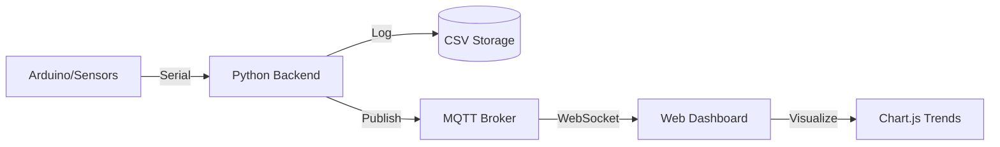

# 🌤️ Weather Workstation IoT

A professional-grade, full-stack IoT ecosystem for real-time environmental monitoring. This project integrates hardware sensing, data processing, and live visualization into a unified platform.

## 🚀 Overview

The **Weather Workstation IoT** system captures high-fidelity environmental data from multiple sensors, processes it through a robust Python backend, and delivers real-time intelligence via an interactive web dashboard. It's designed for reliability, accuracy, and clear data communication.

## 🛠️ Tech Stack

- **Backend:** Python 3.12 (Asynchronous I/O, Threading, Serial Communication)
- **Messaging:** MQTT (Paho-MQTT) for low-latency data distribution
- **Database:** Local CSV for high-availability long-term storage
- **Frontend:** HTML5, CSS3 (Modern Glassmorphism), JavaScript (MQTT over WebSockets)
- **Visualization:** Chart.js for real-time trend analysis
- **Hardware Bridge:** Serial over USB (115200 Baud)

## 📡 Key Intelligence Features

The system monitors and calibrates data for 9 critical environmental metrics:
- 🌡️ **Temperature:** Precision °C monitoring
- 💧 **Humidity:** Relative humidity percentage
- 🫁 **CO2 Levels:** Atmospheric carbon dioxide (ppm)
- 💨 **Oxygen:** Concentration monitoring (%)
- ☀️ **UV Index:** Solar ultraviolet intensity
- 🔆 **Solar Radiation:** W/m² energy measurement
- 🍃 **Air Quality:** Real-time AQI tracking
- 🌪️ **Atmospheric Pressure:** hPa pressure data
- ⚡ **GSR:** Ground skin response/Soil metrics

## ⚙️ Architecture



## 🔐 System Hardening

- **Automatic Calibration:** Converts raw ADC readings into precise engineering units using linear approximation.
- **Fault Tolerance:** Includes automatic MQTT reconnection and serial read retries.
- **Heartbeat Monitoring:** Publishes status updates to `weather/status` for remote health monitoring.
- **Threshold Alerts:** The frontend triggers visual alerts when sensors exceed safety parameters.

## 🚀 Quick Start

### 1. Requirements
```bash
pip install paho-mqtt pyserial
```

### 2. Configure MQTT
Ensure an MQTT broker (like Mosquitto) is running on your network. Update the `MQTT_BROKER` address in `backend.py` and `front_end.html`.

### 3. Run Backend
```bash
python backend.py
```

### 4. Launch Dashboard
Open `front_end.html` in any modern web browser to view live data.

---

Designed and Developed by **Hridhay Bharti**. 🦾
